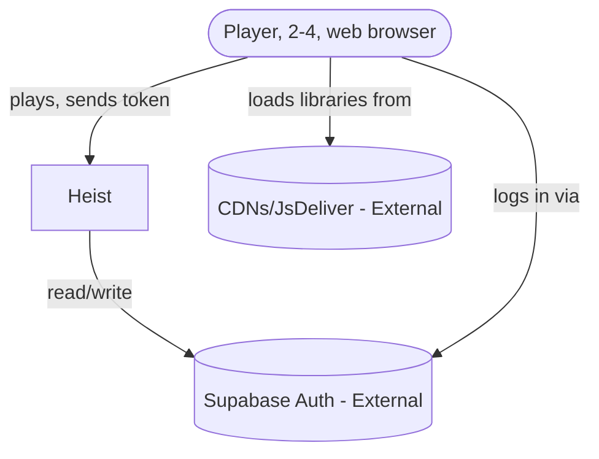
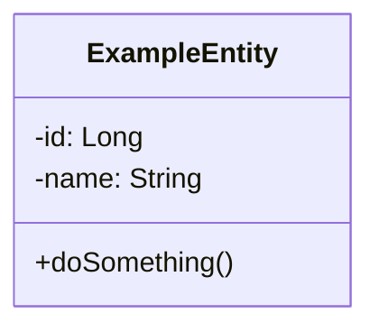
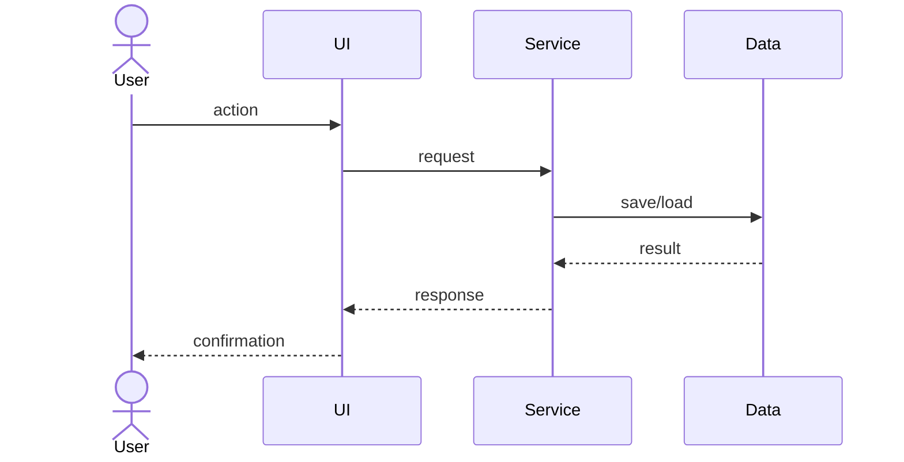

# [Heist]

<!-- CI badge: after Session 4, replace ORG/REPO and the workflow filename, then uncomment:

-->

**Student:** [Enzo Swayne] · **Course:** CEN 5064 Software Design, Fall 2026 · **Partner:** [@JosephGabrie]

## Project (approval paragraph — write this by Sun Aug 30)

I propose developing a small 3D multiplayer heist game that runs in a web browser. This application allows a group to connect to a shared game session,
interact with a 3D environment, coordinate, complete objectives, and escape from the place. The technology used will be Three.js/Javascript on the
client, using ASP.NET Core/C# for the server, SignalR for real-time communication, and Supabase/PostgreSQL for persistence and authentication. The 
main focus is software architecture and design patterns, not gameplay or art. The architecture will be layered with a separation between presentation,
application, domain, and data/infrastructure. The design principles will be SOLID, dependency inversion, and the use of design patterns such as SignalR behind a 
transport/session interface. The game will be small enough to finish, with a focus on use cases such as joining sessions, synched movements, interaction, and
objective completion. Testing will be demonstrable with local tests and multiplayer through at least two browser tabs or simulated clients. My personal 
motivations include a desire to strengthen my Three.js and 3D web dev skills, working with a familiar tech stack, and creating a fun multiplayer experience.

## How to run
### PART 1
For now, if you decide you want to run what I have so far, clone or download zip and unzip. Open command prompt:
```
CD unzipped Directory
CD /Heist
dotnet run
```
Open two browser windows:
First Browser window: go to localhost:7159/
You should now be in login page, login with random name
you should see a spawned box.
press F12 to open Dev Tools, click "console" tab
Here you can see object properties and welcome message for success.

Second browser: go to localhost:7159/
Login with another name
now both windows should have two boxes spawned
in first browser you should see that another "player" has joined" and see their object properties
If having trouble, please see me so I can train you on how to use cmd, dev tools, etc.

```
[Exact commands to build and run your system from a clean clone.
Update this every time the steps change — your partner and your
instructor will follow it literally on conference days.]
```

## Architecture

### Tier breakdown (Session 2 studio)

| Tier | Responsibilities in THIS system | Example Classes/Modules |
|------|--------------------------------|------------|
| Presentation | <ul><li>Displays interactable menu (dialog.js)<li> renders the scene<li> loads models and graphics |<ul><li> SceneManager.js<li> ModelLoader.js<li> Dialog.js<li> LevelLoader.js |
| Service | <ul><li>Sign-in and Out with validation tokens signed by Supabase<li> load player profile and player level layouts<li> match making   | <ul><li>AuthService.EnsureProfile<li> AuthService.SignOut<li> PlayerProfileService.GetPlayableLevels<li> PlayerProfileService.GetLevelParams()<li> MatchResultService.RecordResult()   |
| Domain | <ul><li>trigger a trap by doing A<li> complete the objective by interacting with object B and escaping through plane C<li> the collision rules for the capsules of the players to determine touch and interaction<li> interface that contracts the storing and getting match results <li> interface that stores and retrieves player profiles  | <ul><li>MovementRules.cs<li> CompletionPolicy.cs<li> TrapResolver.cs<li> IMatchResultRepo.cs<li> IPlayerProfileRepo.cs |
| Data | <ul><li>match result table (with winner, time, completion; history)<li> statistics readable<li> score per-level the best times<li> playerprofiles | <ul><li>MatchResultRepo.cs<li> StatisticsRepo.cs<li> LeaderboardRepo.cs<li> PlayerProfileRepo.cs  |


### C4 — Context & Container (Session 3 studio)

```mermaid
%% Container view: your containers should match the tier table above.
flowchart TB
    subgraph YourSystem [Your System]
        ui[Web UI / CLI<br/>Presentation] --> api[Application / Service]
        api --> domain[Domain Model]
        domain --> db[(Database<br/>Data tier)]
    end
```





### UML — Class & Sequence (Session 3 studio)





## Architecture Decision Records

Decisions live in [`docs/adr/`](docs/adr/). Start with ADR-001 in Session 4.

| # | Decision | Status |
|---|----------|--------|
| [001](docs/adr/adr-001.md) | [What I am building and why] | [proposed] |

## Weekly log (optional but recommended)

A one-line note per week keeps your commit story readable:

- Week 1 (Aug 24): repo created, three ideas drafted
- Week 2 (Aug 31): ...
